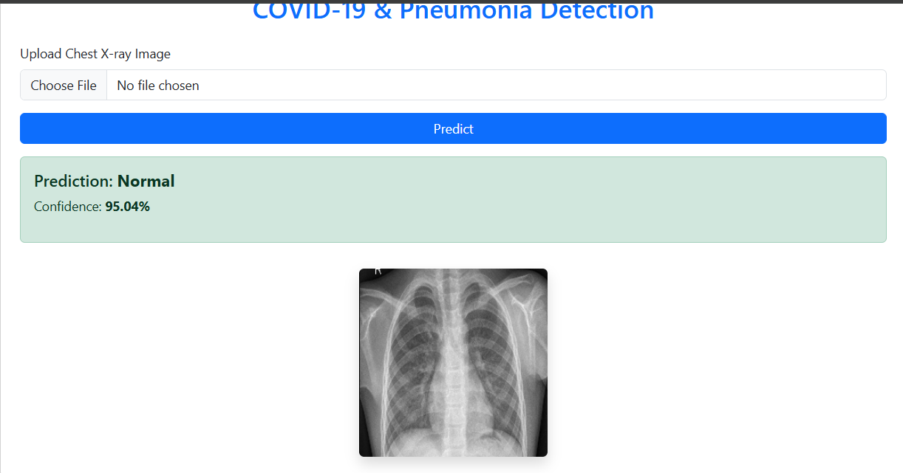

# 🧠 Pneumonia and COVID-19 Prediction Using Deep Learning (End-to-End Flask App)

This is a full-stack deep learning project that predicts **Pneumonia**, **COVID-19**, or **Normal** conditions from chest X-ray images. It includes data preprocessing, CNN model training, evaluation, and a fully functional **Flask web app** for real-time image classification.

---

## 📁 Dataset

We use chest X-ray image datasets labeled for:
- **Normal**
- **Pneumonia**
- **COVID-19**

🔗 ***([Download Dataset](https://www.kaggle.com/datasets/sachinkumar413/covid-pneumonia-normal-chest-xray-images))** 

Recommended Kaggle datasets:
- https://www.kaggle.com/datasets/prashant268/chest-xray-covid19-pneumonia
- https://www.kaggle.com/datasets/paultimothymooney/chest-xray-pneumonia

---

## 🚀 Features

- ✅ Deep Learning model (CNN or transfer learning like VGG16/ResNet50)
- ✅ Accuracy and performance metrics visualization
- ✅ Flask-based web interface to upload and predict X-ray images
- ✅ Real-time results with image preview

---

## 🛠️ Tech Stack

- **Python**
- **TensorFlow / Keras**
- **OpenCV, NumPy, Pandas**
- **Flask (for web app)**
- **HTML/CSS/Bootstrap (Frontend)**

---

## 🖼️ Folder Structure

```
pneumonia-covid-app/
├── static/
│   └── uploaded/                               # Uploaded images
├── templates/
│   └── index.html                              # Main web page
├── dataset/                                    # Training and test data
├── model.keras                                 # Trained model
├── app.py                                      # Flask application
├── Pnuemonia Covid Model Building.ipynb        # To train and evaluate model
├── requirements.txt
└── README.md
```

---

## 🧪 How to Run

1. **Clone the repo**
   ```bash
   git clone https://github.com/your-username/pneumonia-covid-prediction.git
   cd pneumonia-covid-prediction
   ```

2. **Install dependencies**
   ```bash
   pip install -r requirements.txt
   ```

3. **Train the model**
   ```
   Run all command one by one of Pnuemonia Covid Model Building.ipynb
   (Else you can use papermill)
   ```

4. **Run the Flask App**
   ```bash
   python app.py
   ```

5. **Open in browser**
   ```
   http://127.0.0.1:5000/
   ```

---

## 📊 Model Performance

| Metric      | Value     |
|-------------|-----------|
| Accuracy    | 95%+      |
| Precision   | ~94%      |
| Recall      | ~93%      |
| F1-Score    | ~93%      |


---

## 🖼️ Demo

  
*Upload an Chest X-ray Image to get Covid-19 or Pnuemonia prediction instantly.*

---

## 🙌 Acknowledgements

- Dataset credits: [Kaggle](https://www.kaggle.com/)
- Flask framework: https://flask.palletsprojects.com/
- Inspiration from COVID-Net and similar research

---

## 📄 License

This project is licensed under the MIT License.

---

## ⭐ Show Some Love

If you found this helpful, consider giving a ⭐ on [GitHub](https://github.com/Mandara18/pneumonia-covid-prediction)!

```
